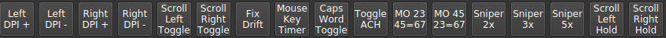
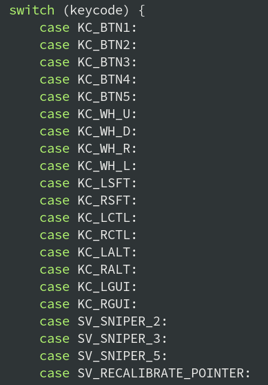

# Svalboard firmware features

This page describes the custom keycodes, layers and other functions of the Svalboard fork of vial-qmk.

*Note:* The firmware is rapidly changing and many features have not been thoroughly tested in combination with each other. If you see unexpected behavior, please open an issue on Github or post in the `svalboard` Discord.

## Quickstart
Once you have installed Vial and connected your Svalboard, you can open a list of user keybindings in the bottom panel:

Hover over each keybinding to see a brief description. To map it to a Svalboard key, select a layer (0 - 15), click a physical key, then click the keybinding.

## Automouse mode
If you move your pointing device the Svalboard will switch to Layer 15 by default. The indicator LEDs will turn magenta, and some of the keys act as mouse buttons.

You can exit this mode by hitting any key not mapped to a mouse button or pointing device feature.

*Note:* Many of the keybindings will not work on the automouse layer, due to the way the key events are processed. A key must be in the following set to not exit the automouse layer (as of commit 226e1200cf826ff17ee65899a6ad0e3d3b751ee1):

This can easily be changed by modifying the `switch` statement visible above in `process_record_kb()` in [keymap_support.c](../keymaps/keymap_support.c). Ask on the Discord for more info.

### Auto-exit timer
[TODO]

### Trackpoint recalibration
If your mouse pointer begins to drift, try recalibrating the zero by hitting 'down' on one of the pinkies.

### Activation threshold
[TODO]

## Sniper mode
[TODO]

## Scroll-mode lock
[TODO]

## Pointer DPI adjustment
[TODO]
