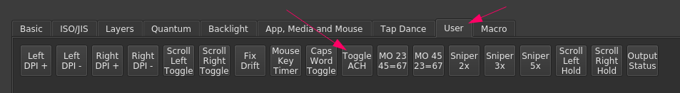
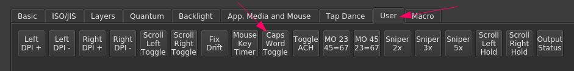
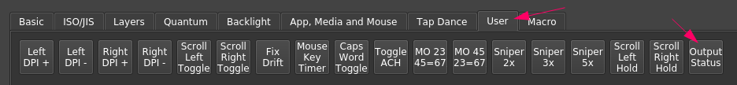

# Non-standard/Advanced Firmware Features

* [Non-standard/Advanced Firmware Features](#non-standardadvanced-firmware-features)
  * [Introduction](#introduction)
  * [Achordion](#achordion)
    * [Toggling Achordion](#toggling-achordion)
    * [Customizing Achordion](#customizing-achordion)
  * [Caps Word](#caps-word)
  * [Dual-Function (Mod-Tap) Keys With Modified/Advanced Tap Values](#dual-function-mod-tap-keys-with-modifiedadvanced-tap-values)
  * [23 + 45 = 67](#23--45--67)
  * [Output Status](#output-status)

## Introduction

The default Svalboard firmware supports a number of firmware features that are
not standard to Vial/QMK, the use/configuration of which is detailed here.

## Achordion

Many users find it helpful to use "mod-tap" keys, where a key acts as a normal
key when tapped but acts as a modifier (e.g. shift) when held. This is commonly
used for what are called "Home Row Mods" (HRMs), where the home row of the
keyboard also functions as modifier keys, freeing up other keys and allowing for
modifiers without finger movement. For instance, the left index finger (on
QWERTY) would function as `f` when tapped and `Shift` when held.

A common problem encountered with such dual-function keys, however, is
unintentional firing of mods with fast rolls, for instance `ds` on QWERTY
resolving as `Ctrl-s` instead. Achordion fixes this problem by defining what
pairs of keys can or cannot resolve to modifiers. By default, the Svalboard will
not consider mod-taps on the same half of the board, unless waiting out a
sufficiently long timer (1000 ms, by default). This allows for fast rolls of
dual-function keys on the same hand without misfire, but has the downside of
slowing down same-handed dual-function use when actually desired.

### Toggling Achordion

If this behavior is not desirable, Achordion can be toggled off/on by binding
the `Toggle ACH` key in the `User` tab of Vial somewhere in your layout and
pressing it.



*The Svalboard remembers this setting, so you won't need to do it every time you
plug in your keyboard.*

### Customizing Achordion

If more complex Achordion behavior than same-hand inactivation is desired, it
can be customized further. This requires compiling custom firmware and should be
attempted only with some knowledge of QMK/C. See [Achordion: Customizing the
tap-hold
decision](https://getreuer.info/posts/keyboards/achordion/index.html#customization)
for more information.

## Caps Word

Caps Word is a modern alternative to Caps Lock, aimed at typing single words in
all-caps. When activated, Caps Word will capitalize letters until either a 5
second idle timer elapses, or any key but the following is pressed:

* `a`-`z`
* `0`-`9`
* `-`/`_`
* `Bksp`/`Del`

In practice, this means that you get one word of capitalization, which is
convenient for typing e.g. `QMK`.

It additionally automatically converts `-` to `_`, making it very easy to type
in `SCREAMING_SNAKE_CASE`.

Using Shift during Caps Word acts the same as during Caps Lock, allowing you to
type lowercase temporarily without inactivating Caps Word.

To use Caps Word, bind `Caps Word Toggle` in the `User` tab of Vial somewhere in
your layout.



## Dual-Function (Mod-Tap) Keys With Modified/Advanced Tap Values

A shortcoming of QMK is that dual-function keys (for instance, mod-taps) can
only have "basic" keycodes as their tapped value. For instance, one cannot have
`!` as the tapped value of a dual-function key, because QMK encodes it as
`Shift-1`.

The Svalboard firmware includes a custom workaround to allow for this behavior:
**If a dual-function key has its tap value set to transparent
(`KC_TRANSPARENT`), it will use the value of the next highest active layer
instead, even if that is a "complex" key.**

Thus, in the following layout, if Layers 4 and 5 are active, and the circled key
is held, it will resolve to shift, due to the mod-tap defined on layer 5, but if
it is tapped, it will resolve to `#`, as the tap value is transparent on layer
5, and the value on layer 4 is set to `Shift-3`.


If you have difficulty with this feature, remember that you need to have both
layers active! It will take the value of the next *active* layer, not the layer
immediately numerically beneath.

## 23 + 45 = 67

Activating a layer while a key is held is a common feature in many individuals'
layouts. For instance, one might hold a thumb key down to activate a number and
symbol layer.

The Svalboard firmware includes two custom keys to make this work even better.

The keys labeled `MO 23 45=67` and `MO 45 23=67` in the `User` tab of Vial have
the following behavior:

* When held, they **activate two layers**, not just one. `MO 23 45=67` will activate
  layer 2 and 3, while `MO 45 23=67` will activate layer 4 and 5.
* **When both are held, they activate layer 6 and 7**. Thus, this behavior is
  referred to as "23 + 45 = 67."


The advantages of these keys are as follow:

* Activating two layers at once means it is easy to use modified mod-tap keys
  (see [Dual-Function (Mod-Tap) Keys With Modified/Advanced Tap
  Values](#dual-function-mod-tap-keys-with-modifiedadvanced-tap-values) for more
  information); if you will have HRMs on a layer with symbols, this is
  essential, as you can place your mod-taps on layer 3 and your modified values
  on layer 2, for example.
* Three layers can be reached with only two keys, with the third layer being
  reached by holding both (regardless of the order they are pressed in).

## Output Status

The `Output Status` key in the `User` tab of Vial is useful for debugging
purposes.

Binding it in your layout and pressing it will make the Svalboard type out info
about its current state:

```text
<firmware version of master>
Left Ptr: Scroll <yes/no>, cpi: <current DPI>, Right Ptr: Scroll <yes/no>, cpi: <current DPI>
Achordion: <yes/no>, MH Keys Timer: <current automouse timeout in ms, or -1 for infinite>
```


